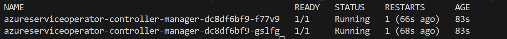

# Lab 03. Using ASO v2

[Azure Service Operator](https://azure.github.io/azure-service-operator/) (ASO) is a Kubernetes Operator that enables you to provision and manage Azure services using Kubernetes. Instead of deploying and managing your Azure resources separately from your Kubernetes application, ASO allows you to manage them together, automatically configuring your application as needed. For example, ASO can set up your Redis Cache or PostgreSQL database server and then configure your Kubernetes application to use them. ASO v2 is the latest version of ASO and supports more than 150 different Azure resources, with more added every release. See the full list of [supported resources](https://azure.github.io/azure-service-operator/reference/).

## Setup ASO v2

1. Install [cert-manager](https://cert-manager.io/docs/installation/kubernetes/) on the cluster using the following command.

    ```bash
    # set context
    kubectl config use-context plat-eng-01

    # install cert-manager
    kubectl apply -f https://github.com/jetstack/cert-manager/releases/download/v1.14.4/cert-manager.yaml
    ```

    Check that the cert-manager pods have started successfully before continuing.

    ```bash
    kubectl get pods -n cert-manager
    ```

    


2. Configure authentication and install ASO

    There are several options but we are going to use a User Assigned Identity (UAI) configured for the aKS cluster. This UAI grants Azure Service Operator permissions to create resources in your subscription. In this example the UAI is configured to have 'Contributor' role on the subscription. To learn more about other authentication options, see the [authentication documentation](https://azure.github.io/azure-service-operator/guide/authentication/).

    First, copy file `.env.template` to a new file `.env`, edit it and customize the values for your environment. Next, run the script `install-aso-01.sh` to install the ASO v2.

    ```bash
    ./install-aso-01.sh
    ```
    
    The script will use a User Assigned Identity (UAI) and assign it the 'Contributor' role on the subscription. Finally, it will install the ASO v2 in the cluster with the below command:

    ```bash
    helm upgrade --install aso2 aso2/azure-service-operator \
        --create-namespace \
        --namespace=azureserviceoperator-system \
        --set azureSubscriptionID=$AZURE_SUBSCRIPTION_ID \
        --set azureClientID=$AZURE_CLIENT_ID \
        --set crdPattern='resources.azure.com/*;containerservice.azure.com/*;keyvault.azure.com/*;managedidentity.azure.com/*;eventhub.azure.com/*;cache.azure.com/*'
    ```

    [!WARNING] ASO does not install all available CRDs by default, so ensure you set the `crdPattern` variable to include the CRDs you are interested in using.
    You can use `--set crdPattern=*` to install all the CRDs, but be aware of the [limits of the Kubernetes you are running](https://github.com/Azure/azure-service-operator/issues/2920).
    Using `*` is not recommended on AKS Free-tier clusters.

    See [CRD management](https://azure.github.io/azure-service-operator/guide/crd-management/) for more details.


### Usage and test

Once the controller has been installed in your cluster, you should be able to run the following:

```bash
kubectl get pods -n azureserviceoperator-system
```



Let's test it and create an Azure ResourceGroup in westeurope with the name "aso-sample-rg":

```bash
kubectl apply -f test-rg.yaml
```

Let's see what the ResourceGroup resource looks like:

```bash
kubectl get resourcegroups/aso-sample-rg
```

Also, check it in the Azure Portal.

Cleanup:

```bash
# delete the ResourceGroup
kubectl delete resourcegroups/aso-sample-rg
```

For samples of additional resources, see the [resource samples directory](https://github.com/Azure/azure-service-operator/tree/main/v2/samples).


## Deploy the application and Azure resources

The YAML documents in azure-vote-managed-redis.yaml create:

- A Kubernetes namespace named azure-vote,
- An Azure resource group named aso-redis-demo,
- An Azure Cache for Redis instance.
- A deployment and service for the popular [AKS voting sample app](https://github.com/Azure-Samples/azure-voting-app-redis).

The redis.cache.azure.com instance is configured to retrieve two secrets that are produced by the Azure Cache for Redis instance - hostname and primaryKey. As described [here](https://azure.github.io/azure-service-operator/guide/secrets/#how-to-retrieve-secrets-created-by-azure), these secrets need to be mapped to our sample application and the container for our sample application will be blocked until these two secrets are created.

The Voting Sample is configured with environment variables that read the secrets for the managed Redis hostname and access key, allowing the sample to use the managed cache.

### Steps to install

Run the provided script `deploy-app-02.sh` to deploy the application to the AKS cluster. Prior to run it copy the file `.env.template` to a new file `.env` and customize it according to your environment.

```bash
./deploy-app-02.sh
```

The operator will start creating the resource group and Azure Cache for Redis instance in Azure. You can monitor their progress with:

```bash
watch kubectl get -n azure-vote-03 resourcegroup,redis
```

You can also find the resource group in the Azure portal and watch the Azure Cache for Redis instance being created there.

### Note
It may take a few minutes for the Azure Cache for Redis to be provisioned. In that time, you may see some ResourceNotFound messages in the logs indicating that the secret, the Azure Cache for Redis or the application deployment are not ready. This is OK! Once the Redis instance is created, secrets will be created and will unblock the sample application container creation. All errors will eventually resolve once the Redis instance is provisioned. These errors are ASO monitoring the creation of each resource, allowing it to take the next step as soon as the resource is available.


## Test the application

When the application runs, a Kubernetes service exposes the application front end to the internet. This process can take a few minutes to complete.

```bash
kubectl get service azure-vote-front -n azure-vote-03
```

Copy the EXTERNAL-IP address from the output. To see the application in action, open a web browser to the external IP address of your service.

Alternatively, for kind clusters, you can also use the following command

```bash
kubectl port-forward -n azure-vote service/azure-vote-front 8080:80
```

If you're interested in code for the application, it is available [here](https://github.com/Azure-Samples/azure-voting-app-redis).


## Clean up

When you're finished with the sample application you can clean all of the Kubernetes and Azure resources up by deleting the azure-vote namespace in your cluster.

```bash
kubectl delete namespace azure-vote-03
```

Kubernetes will delete the web application pod and the operator will delete the Azure resource group and resources.


## References

- [Azure Service Operator](https://azure.github.io/azure-service-operator/)
- [ASO v2 Setup](https://azure.github.io/azure-service-operator/docs/setup/aso-v2/)
- [Hello World Example](https://azure.github.io/azure-service-operator/tutorials/tutorial-redis/)
- [Sample with Redis](https://github.com/Azure-Samples/azure-service-operator-samples/tree/master/azure-votes-redis)
