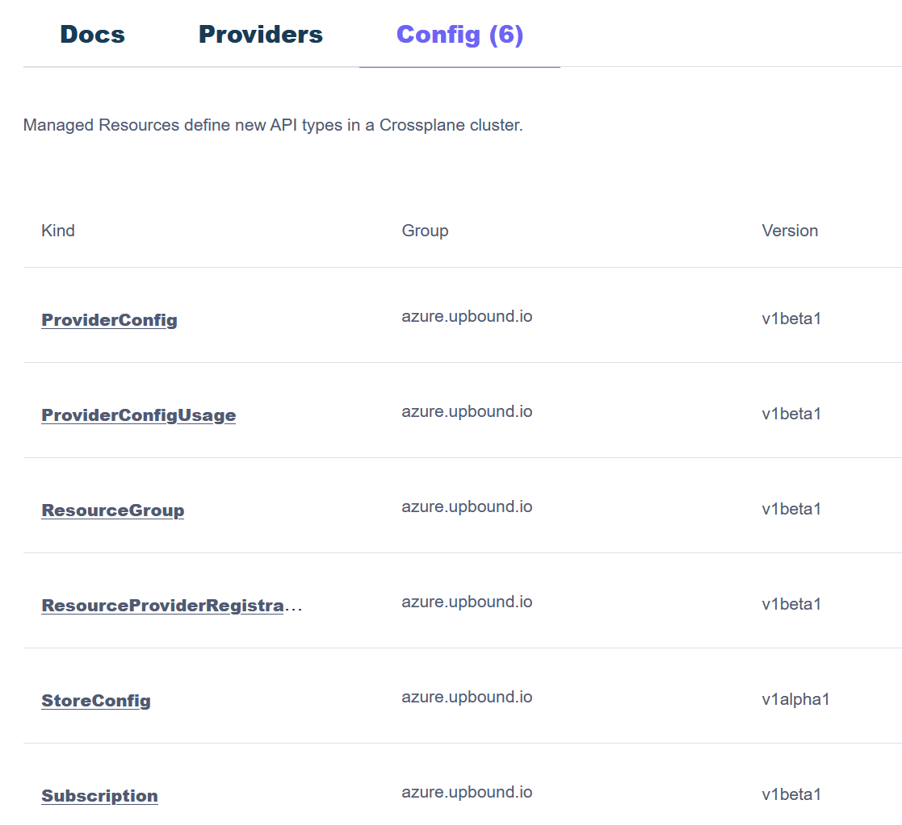

# Lab 04. Using Crossplane

Crossplane is an open-source Kubernetes add-on that extends Kubernetes to create and manage infrastructure using Kubernetes-style APIs. It allows you to define and manage cloud resources, including Azure, using Kubernetes manifests.

## Installing & Configuring Crossplane

Crossplane is made up muliple providers for clouds and their resources, initally to start you ned to install the Azure provider here.

From your Terminal run:

```bash
# Install up
curl -sL "https://cli.upbound.io" | sh
sudo mv up /usr/local/bin/
up version
``` 

```bash
# Install Universal Crossplane
up uxp install

# wait until pods running
kubectl get pods -n upbound-system
```


### Install the Azure provider

Check for the latest version of the [provider for Azure](https://marketplace.upbound.io/providers/upbound/provider-family-azure/v1.11.1)


Note this is the Upbound Official Azure provider, not the community provider!

Run this command to install the provider:

```bash
kubectl apply -f provider-azure.yaml
```

It may take up to 5 minutes to report HEALTHY==true.

```bash
kubectl get providers.pkg.crossplane.io
```


### Setup provider authentication

Setting up provider permissions to Azure can follow different options. In this example we are going to use a User Assigned Identity (UAI) for the AKS cluster, this is a recommended approach as it is more secure than using a Service Principal.

When we created the AKS cluster in the previous lab 01 we created a UAI for the cluster. We will use this UAI to authenticate with Azure and we will grant 'Contributor' permissions to the AKS UAI on the subscription. Note, this is NOT recommended, it is for demonstration purposes. You must be conservative and just grant the identity contributor to a resource group or custom role, however you may find that deployments may require permissions outside of the resource group, or you may even wish to have Crossplane create RG's with RBAC etc.

Run the following commands to get the UAI, set the permissions and configure the Crossplane Azure provider:

```bash
./configure-provider-01.sh
```

## Deploying Resources & Providers

The core Azure provider only support a ~6 Kinds which link to specific Azure operations or resouces, you can see these by going to ['ProviderConfig' tab](https://marketplace.upbound.io/providers/upbound/provider-family-azure/v1.11.1/config), one of them is 'Resource Group':



Now if you want to create a ResourceGroup, click on it, and this will show you the API documentation, what can be set, then the 'Example' tab shows an example. To test if the Crossplane installation has been successful run:

```bash
kubectl apply -f resourcegroup.yaml
```

This will create a K8s resource of the Kind 'ResourceGroup', so you can interact with it like any other K8s resource, to check the status"

```bash
kubectl describe ResourceGroup rg-myfirst
```

If this has worked successfully you should see Successfully requested creation of external resource in the Events and naturally check your Azure subcription and check if the resource group was created.

To delete the resource group, you can change the creation YAML to 'kubectl delete -f..', or just run:

```bash
kubectl delete ResourceGroup rg-myfirst
```

## Deploying more resources

To be able to deploy and manage more Azure resources you need to install additional providers, go to the ['Providers' tab](https://marketplace.upbound.io/providers/upbound/provider-family-azure/v1.11.1/providers) and you will see more of them.


Let's for example select provider-azure-cache:


Upon clicking `Install Package Manifest` you will see this, which you can run:

```yaml
apiVersion: pkg.crossplane.io/v1
kind: Provider
metadata:
  name: provider-azure-cache
spec:
  package: xpkg.upbound.io/upbound/provider-azure-cache:v1
```

Run this command to install the azure cache provider:
```bash
kubectl apply -f provider-azure-cache.yaml
```

You can check which providers are installed and healthy by running:

```bash
kubectl get providers.pkg.crossplane.io
```


## References

- [Crossplace setup guide](https://github.com/danielsollondon/platform-engineering/blob/main/readme.md)
- [Crossplane provider for Azure](https://marketplace.upbound.io/providers/upbound/provider-family-azure/v1.11.1)