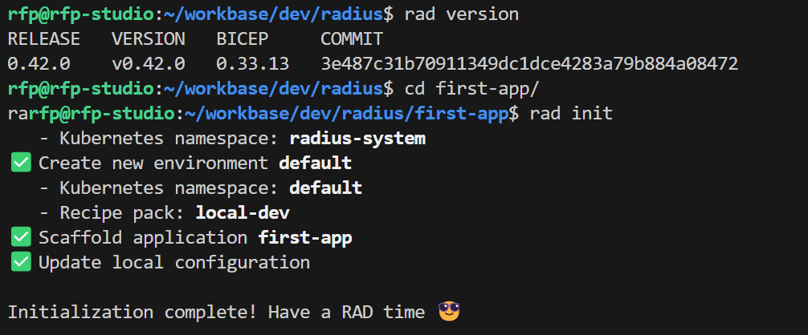

# Lab 05. Using Radius

Simple scneario with a container running the app and a cloud native database.


## References
- https://radapp.io/


## Step 1. Setup

https://docs.radapp.io/getting-started

Pre-requisites: a k8s cluster

```bash
# Install Radius CLI
wget -q "https://raw.githubusercontent.com/radius-project/radius/main/deploy/install.sh" -O - | /bin/bash

# Verify the rad CLI is installed correctly
rad version

# Init new project
mkdir first-app
cd first-app
rad init
```



This does th following tasks:
- Starting Radius services in your Kubernetes cluster
- Creates a default application (app.bicep) with a demo app with a single container definition
- bicep setup file for bocep: bicepconfig.json


## Step 2. Run the app

```bash
rad run app.bicep
```
Open http://localhost:3000 in a browser.

View application graph:
```bash
rad app graph -a first-app
```

Cleanup:
```bash
rad app delete first-app -y
```
