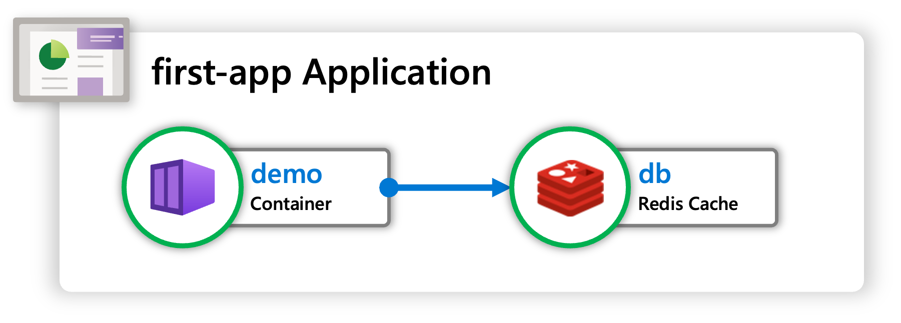
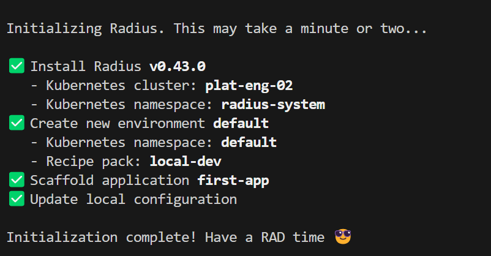
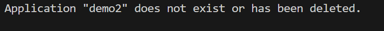
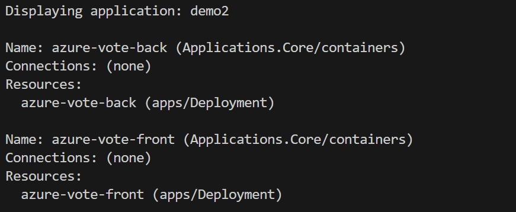
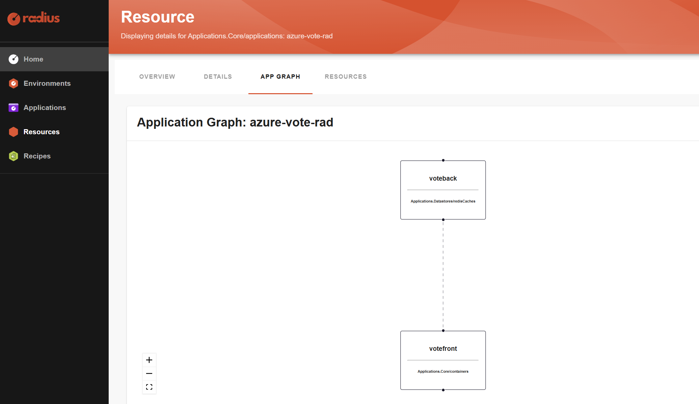

# Lab 05. Using Radius

[Radius](https://radapp.io/) is an open-source, cloud-native, application platform that enables developers and the operators that support them to define, deploy, and collaborate on cloud-native applications across public clouds and private infrastructure.

Simple scneario with a container running the app and a cloud native database.




## Step 1. Setup

https://docs.radapp.io/getting-started

Pre-requisites: a k8s cluster

```bash
# Install Radius CLI
wget -q "https://raw.githubusercontent.com/radius-project/radius/main/deploy/install.sh" -O - | /bin/bash

# Verify the rad CLI is installed correctly
rad version

# Init new project
mkdir first-app
cd first-app
rad init
```



This does the following tasks:
- Starting Radius services in your Kubernetes cluster
- Creates a default application (app.bicep) with a demo app with a single container definition
- bicep setup file for bocep: bicepconfig.json

Check deployment in your K8s cluster:

```bash
kubectl get all -n radius-system
```

List your environment:

```bash
rad env list
```


## Step 2. Run the app

```bash
rad run app.bicep
```
Open http://localhost:3000 in a browser.

View application graph:
```bash
rad app graph -a first-app
```

Cleanup:
```bash
rad app delete first-app -y
```

## Azure Vote existing app

```bash
cd azure-vote
kubectl create namespace demo
kubectl apply -n demo -f azure-vote-all-in-one-redis.yaml
kubectl get pods -n demo
```

Validate that radius is has not been added yet:
```bash
rad app graph -a demo -g default-demo
```



In each of the YAML files that contain a manifest for `Kind: Deployment`, add the `annotations` property to `metadata`, and then add the `radapp.io/enabled: 'true'` annotation. Note that the `'true'` must be surrounded in quotes.

```yaml
...
metadata:
   ...
   annotations:
      radapp.io/enabled: 'true'
   ...
spec:
...
```

```bash
kubectl apply -n demo -f azure-vote-all-in-one-redis-radius.yaml
kubectl get pods -n demo
```

Validate that radius has been added now:
```bash
rad app graph -a demo -g default-demo
```




## Azure Vote native Radius

Let's try to use this same app but creating natively in Radius:

```bash
cd azure-vote-rad
rad init

# check app graph - empty
rad app graph -a azure-vote-rad -g default

# start app
rad run app.bicep

# check now the app graph
rad app graph -a azure-vote-rad -g default
```



Test it:

```bash
# check services
kubectl get svc -n default-azure-vote-rad

# forward
kubectl port-forward svc/votefront -n default-azure-vote-rad 8003:80

# open in browser
# http://localhost:8003
```

Access Radius Dashboard UI:

```bash
kubectl port-forward svc/dashboard -n radius-system 8004:80
```

## References

- [Radius](https://radapp.io/)
- [First app](https://docs.radapp.io/getting-started/)
- [Add Radius to existing app](https://docs.radapp.io/tutorials/add-radius/)
- [Author Recipes](https://docs.radapp.io/guides/recipes/howto-author-recipes/)
- [Terraform Recipes](https://docs.radapp.io/guides/recipes/terraform/overview/)
